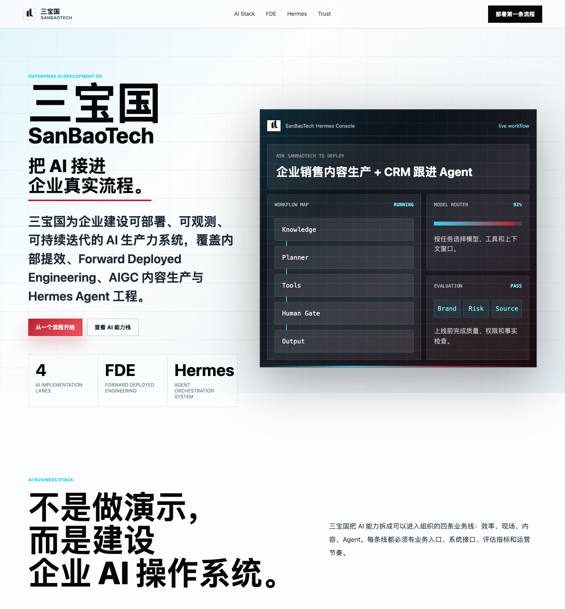

# AI Corporate Website Generator

*面向企业门面官网的品牌设计生成工具*

这个项目整体是一套 **为企业打造的全面品牌设计系统**：从品牌定位、Logo、色彩、文字排版、视觉资产，到不同业务场景的品牌表达，帮助企业把“我是谁、做什么、什么调性、能给用户什么”系统化地表达出来。

这个分支专门用于生成 **企业门面官网**。它面向不想从零写代码、也不想套普通模板的企业团队：输入企业信息、品牌资产和业务方向，几分钟内生成一个有高级感、能讲清业务、能体现品牌调性的官网范本。

[](LICENSE) [](#安装) [](#技能) [](#codex-与官网生成)

**中文** &nbsp;·&nbsp; **[English](README.md)**

[安装](#安装) · [官网工作流](#企业品牌名片型官网工作流) · [Runtime](#design-skill-runtime-v2) · [技能](#技能) · [Schema](#输入-schema) · [FAQ](#常见问题)

---

## 示例效果

下面是用三宝国品牌资产和 AI 业务方向生成的企业门面官网示例。它不是完整长图预览，而是截取首屏和关键叙事开头，方便快速判断官网的品牌气质、业务表达和视觉完成度。

<p align="center">
  
</p>

---

## 为什么需要它

企业官网吗不是一张好看的长图，也不是几个营销卡片的组合。它是用户理解企业的第一入口：第一眼要知道这家公司是谁，第二眼要知道它能解决什么问题，继续看下去要建立信任并愿意行动。

这个分支把官网生成拆成品牌设计工作流，而不是网页拼装工作流：

```text
企业信息 / 品牌资产 / 业务方向
-> 产品经理访谈与价值澄清
-> 文案与术语校验
-> 品牌、色彩、文字和视觉系统设计
-> 企业官网页面与素材分目录输出
-> 总设计复核
```

官网是主交付物。Brand DNA、Logo、配色、文案、文字排版、视觉素材和 UI 都是为了让官网更准确、更高级、更有企业识别度。

核心能力：

1. **无需写代码**：用自然语言描述企业、业务和品牌偏好，即可得到官网设计方案与静态范本。
2. **几分钟出官网雏形**：先形成可讨论、可预览、可继续交付的高级感官网，而不是停留在抽象建议。
3. **品牌驱动视觉系统**：不是套模板，而是从品牌资产、行业属性和业务价值推导官网视觉语言。
4. **企业品牌名片型首屏**：明确公司名称、业务类别、核心价值、目标用户、可信调性和行动入口。
5. **分目录交付**：产品简报、文案校验、设计方向、品牌设计、色彩系统、文字系统、视觉素材、UI、官网模板分别输出。

## 安装

[`npx skills add`](https://github.com/vercel-labs/agent-skills) CLI 会扫描 `skills/` 目录，十个技能安装方式相同。

安装全部技能：

```bash
npx skills add https://github.com/SanbaoAI/logo-generator-skill
```

按**安装名**单独安装：

```bash
npx skills add https://github.com/SanbaoAI/logo-generator-skill --skill "brand-orchestrator"
npx skills add https://github.com/SanbaoAI/logo-generator-skill --skill "brand-agent-roles"
npx skills add https://github.com/SanbaoAI/logo-generator-skill --skill "brand-architect"
npx skills add https://github.com/SanbaoAI/logo-generator-skill --skill "base-logo-generator"
npx skills add https://github.com/SanbaoAI/logo-generator-skill --skill "mascot-logo-generator"
npx skills add https://github.com/SanbaoAI/logo-generator-skill --skill "logo-colorway-generator"
npx skills add https://github.com/SanbaoAI/logo-generator-skill --skill "content-copy-validator"
npx skills add https://github.com/SanbaoAI/logo-generator-skill --skill "typography-system-designer"
npx skills add https://github.com/SanbaoAI/logo-generator-skill --skill "japanese-typography-consultant"
npx skills add https://github.com/SanbaoAI/logo-generator-skill --skill "corporate-website-generator"
```

也可以复制 `SKILL.md` 到项目中，或粘贴到 Codex / Claude Code / Cursor 对话中：

```bash
cp -r skills/brand-orchestrator ~/.codex/skills/
```

## 技能

每个技能只做一件事，不需要全部安装。`安装名` 列是你传给 `--skill` 的确切值。

| 技能（目录） | 安装名 | 说明 |
| --- | --- | --- |
| **corporate-website-generator** | `corporate-website-generator` | 核心技能：企业官网吗生成器。通过 PM 访谈、文字内容校验、总设计策略、品牌设计、色彩设计、文字排版、文字顾问、视觉素材设计和 UI 设计，生成企业品牌名片型官网范本及分目录交付结构。 |
| **brand-orchestrator** | `brand-orchestrator` | AI Brand Architect 系统的完整工作流总控。规划项目、启动或模拟专家 subagent、分派研究与创意任务、运行阶段门、解决冲突、路由到视觉技能并组装最终交付。 |
| **brand-agent-roles** | `brand-agent-roles` | 面向 subagent 团队的分工技能。定义专家角色、任务提示词、输出契约、交接规则、边界和 QA 责任，覆盖品牌考古、人文洞察、神话、文明、符号、审核、视觉、提示词和指南。 |
| **brand-architect** | `brand-architect` | 完整 AI Brand Architect 工作流。先构建 Brand DNA，再开始视觉：历史语境、人文叙事、荣格原型、品牌神话、品牌文明、符号发现、辨识度评分、克制评分、时间测试、视觉识别和品牌指南。Logo 是最终表达，不是起点。 |
| **base-logo-generator** | `base-logo-generator` | 高级克制的 Logo 设计，用于公司、产品、App、活动、文创标志。符号逻辑来自品牌策略、隐喻、几何、负形和字体，不从吉祥物出发。输出黑白/象牙白品牌系统展示板。 |
| **mascot-logo-generator** | `mascot-logo-generator` | 吉祥物衍生 Logo。从动物、角色、物体或天体出发，提取一个标志性特征（爪印、鹿角、月牙、象牙等），压缩为扁平、可缩放、可注册的剪影标志。展示板排版与基础技能一致。 |
| **logo-colorway-generator** | `logo-colorway-generator` | 后处理：为已有 Logo 或展示板增加场景化配色。保留原始符号、字标和轮廓。生成 2-4 条配色路线（含 hex 值）、标志性主色和真实应用场景。 |
| **content-copy-validator** | `content-copy-validator` | 文字内容校验。用于术语、缩写、事实主张、命名一致性、中文表达、中英混排、CTA 清晰度和未证实主张检查。 |
| **typography-system-designer** | `typography-system-designer` | 文字排版系统设计。用于官网、AI/科技产品页、dashboard、中英混排、字号系统、标题断行、CTA 层级和响应式文字 QA。 |
| **japanese-typography-consultant** | `japanese-typography-consultant` | 文字排版顾问。借鉴日本设计的留白、语义断行、网格秩序、安静正文和中英混排层级，审查中文与东亚文字排版。 |

### 怎么选？

- 当你要做“企业品牌名片型官网”或下一代企业官网范本时，优先用 **corporate-website-generator**。
- 当你需要端到端系统、subagent 分派、阶段门、整合、QA 和最终交付时，用 **brand-orchestrator** 组织全流程。
- 当你需要定义专家团队、角色提示词、输出契约和交接规则时，用 **brand-agent-roles**。
- 当你需要 Brand DNA、文化根源、策略、符号验证、时间测试和品牌指南时，用 **brand-architect**。
- 用 **base-logo-generator** 做企业和产品 Logo —— 干净、高级、克制。
- 当标志需要来自动物、角色或天体特征时，用 **mascot-logo-generator**。
- 当 Logo 已经存在、需要记忆点配色、场景应用或标志性主色时，用 **logo-colorway-generator**。
- 当术语、缩写、事实主张、命名、中文文案、中英混排或 CTA 需要设计前校验时，用 **content-copy-validator**。
- 当文字层级、中英混排、标题节奏、响应式字号、CTA/标签可读性需要单独设计时，用 **typography-system-designer**。
- 当中文断行、东亚文字节奏、日式留白、安静正文和中英混排层级需要资深顾问审查时，用 **japanese-typography-consultant**。
- 当已有 Logo 需要成为官网里的品牌资产时，再调用 **base-logo-generator**、**mascot-logo-generator** 或 **logo-colorway-generator** 做支撑。
- 推荐官网流水线：**corporate website → copy validation → typography → typography consultant → visual assets → UI → review**。

## Codex 与官网生成

十个技能都原生支持 **Codex**。当 subagent 可用时，总调度技能可以并行分派专家任务；当图像生成工具可用时（如 Codex `imagegen`、ChatGPT Images），视觉技能可以生成品牌素材；当目标是官网时，`corporate-website-generator` 会输出页面结构、视觉系统、素材目录和可检查的静态官网范本。

**没有前端或图像工具？** 技能仍会返回结构化官网设计方案、页面叙事、素材清单、文案校验和可交给设计/开发继续执行的提示词。

**系统提示：** 在 prompt 中声明目标 —— 例如"用我们的 Logo 和品牌信息生成一个企业品牌名片型官网" —— agent 会优先走官网工作流，而不是只做 Logo 或展示板。

## 工作流

```
   第一步 — 企业澄清          第二步 — 内容与品牌系统          第三步 — 官网设计          第四步 — 分目录交付
 ┌──────────────────────┐   ┌──────────────────────────┐   ┌──────────────────────┐   ┌──────────────────────────┐
 │ PM intake             │ → │ Copy + Brand + Typography │ → │ Visual assets + UI    │ → │ Website template + QA    │
 └──────────────────────┘   └──────────────────────────┘   └──────────────────────┘   └──────────────────────────┘
   公司是谁、做什么、给谁        术语、Logo、色彩、文字            页面布局、素材、交互           官网文件、素材目录、复核
```

每个技能都可独立使用，但这个分支默认把官网作为主场景。Logo、配色和 Brand DNA 是企业官网的上游材料，不是最终宣传重心。

## 企业品牌名片型官网工作流

`corporate-website-generator` 的目标不是堆一个通用营销页，而是让官网第一屏成为企业品牌名片：访客应该在 3-5 秒内知道公司是谁、做什么、什么调性、能得到什么，以及下一步该怎么联系或开始。

```text
Product Manager
-> Content Copy Validator
-> Design Director
-> Brand Designer
-> Color Designer
-> Typography System Designer
-> Japanese Typography Consultant
-> Visual Asset Designer
-> UI Designer
-> Design Director Final Review
```

关键质量门：

| 质量门 | 检查内容 |
| --- | --- |
| 首屏识别 | 企业名称、行业类别、核心业务、目标用户、主要收益和代表性视觉必须可见。 |
| 内容校验 | 术语、缩写、事实主张、命名一致性、中文表达、中英混排和 CTA 必须先过审。FDE 统一校验为 `Forward Deployed Engineer / Forward Deployed Engineering`，禁止写成 `Field Deployment Engineering`。 |
| 视觉调性 | 色彩、排版、图标、插图、背景和 UI 需要共同表达企业性格，而不是依赖通用 AI 渐变。 |
| 中文排版 | 标题断行要有语义，正文留白要克制，中英混排要有秩序，并通过日式排版顾问审查。 |
| 分目录交付 | 产品简报、内容校验、设计方向、品牌设计、色彩系统、文字系统、文字顾问、视觉素材、UI、官网模板和最终复核分别输出。 |

仓库中包含一个三宝国 AI 业务官网示例：

| 文件 | 说明 |
| --- | --- |
| `outputs/sanbao-ai-official-site/index.html` | 静态官网范本入口 |
| `outputs/sanbao-ai-official-site/styles.css` | 科技感、高级感、响应式视觉系统 |
| `outputs/sanbao-ai-official-site/script.js` | 轻量交互 |
| `outputs/sanbao-ai-official-site/design-brief.md` | 设计简报、内容校验和 FDE 术语规则 |

## Design Skill Runtime v2

仓库现在包含一个轻量 Python runtime，用于多场景品牌视觉生成：

```text
User Input
-> Skill Router
-> Selected Skill
-> Prompt Compiler
-> Generation Engine
-> Critic Agent
-> Memory Writer
```

Runtime 模块：

| 模块 | 职责 |
| --- | --- |
| `core/prompt_compiler.py` | 合并 brand memory、last design、scene context 和 task，生成结构化 prompt。 |
| `skills/skill_router.py` | 将请求路由到 `corporate_website_skill`、`social_media_skill`、`ppt_skill`、`poster_skill` 或 `logo_skill`。 |
| `skills/corporate_website_skill.py` | 将企业简报转成多岗位协作的企业品牌名片型官网设计包，并规划分目录输出。 |
| `skills/social_media_skill.py` | 将品牌 DNA 与内容输入转成可发布的社交媒体 carousel 方案。 |
| `core/critic_agent.py` | 评估 clarity、brand consistency、visual balance，并返回问题列表。 |
| `core/memory_writer.py` | 写入 asset history，并更新 visual DNA。 |
| `core/runtime.py` | 执行完整 route -> compile -> skill -> critic -> memory 闭环。 |

测试命令：

```bash
python3 -m unittest discover -s tests
```

内置测试会验证社交媒体输出，也会验证："帮我做一个企业品牌名片型官网" -> `corporate_website_skill` -> PM 简报、总设计策略、品牌/色彩/素材/UI 方案、分目录结构、critic 评分和 memory history 写入。

---

## `brand-orchestrator`

完整 AI Brand Architect 系统的工作流总控。它决定哪些专家任务可以并行、每个 subagent 必须返回什么、何时整合，以及什么时候通过阶段门。

**输出：**

| 板块 | 内容 |
| --- | --- |
| Orchestration Plan | 范围、假设、任务路线、subagent 阵容和阶段门 |
| Delegation Briefs | 可直接交给专家 subagent 的任务说明 |
| Integration Matrix | 品牌考古、人文意义、符号、审核和视觉之间的连接关系 |
| Gate Decisions | 策略、符号和视觉阶段后的继续、修正或停止判断 |
| Final Assembly | Brand DNA、视觉识别方向、提示词、指南和 QA 备注 |

---

## `brand-agent-roles`

面向专家 subagent 的分工层。用于在调度前或调度中定义团队结构。

**核心角色：**

| 角色 | 职责 |
| --- | --- |
| Brand Archaeologist | 文化根源、历史语境、设计传统 |
| Human Insight Strategist | 人类需求、情感意义、用户张力 |
| Archetype and Myth Strategist | 荣格原型、品牌神话、反对信念 |
| Civilization Builder | 价值观、禁忌、信徒、仪式、图腾 |
| Semiotic Symbol Scout | 符号候选、隐喻、文化风险 |
| Distinctiveness Auditor | 记忆点、轮廓、小尺寸、竞品距离 |
| Restraint and Time Auditor | 克制、生产可用性、时间测试 |
| Visual Identity Director | Logo 方向、字体、色彩、系统设计 |
| Prompt Producer | 选定平台的图像生成提示词 |
| Guidelines Editor | 最终品牌规则、使用方式和延展原则 |

---

## `brand-architect`

完整 AI Brand Architect 工作流。它先回答一个更重要的问题：这个品牌如果活 100 年，会因为什么被人记住？

**输出：**

| 板块 | 内容 |
| --- | --- |
| Brand DNA Summary | 品牌是什么、服务谁、应被记住什么 |
| Historical Context | 文化根源、行业起源、设计传统、文化母体 |
| Human Narrative | 产品背后的功能需求、情感需求和精神需求 |
| Archetype System | 主人格、副人格、行为、语气和视觉后果 |
| Brand Myth | 存在理由、反对什么、转化承诺、一句话神话 |
| Brand Civilization | 价值观、禁忌、信徒、仪式、图腾、语言 |
| Symbol System | 从几何、历史、文化和产品意义中提取 Top 20 符号 |
| Distinctiveness Engine | 记忆、轮廓、小尺寸、竞品距离、可占有性评分 |
| Restraint Engine | 删除装饰噪音、验证单色和真实生产可用性 |
| Time Machine | 5 年前、今天、10 年后、30 年后的时间测试 |
| Visual Identity | Logo、字标、色彩、字体、插画、动效、设计语言 |
| Brand Guidelines | 使用规则、禁用规则、延展原则和应用场景 |

<details>
<summary>示例输入</summary>

```json
{
  "brand_name": "Leios",
  "industry": "AI design tools",
  "product": "A thinking-first AI design platform that helps creators turn ideas into visual identity systems.",
  "target_users": "Independent creators, product founders, and small teams who need design judgment before visual execution.",
  "founder_story": "The brand was created from the belief that design should return to thinking, not visual noise.",
  "research_depth": "deep",
  "output_mode": "full-system"
}
```
</details>

> 使用 brand-architect skill 构建 Brand DNA，然后生成视觉识别。

---

## `base-logo-generator`

高级克制的 Logo 设计 —— 任何品牌识别的基础。符号来自品牌策略、隐喻、几何、负形或产品意义，不从吉祥物出发。结果应该看起来精致、经久耐用、具有独特辨识度。

**输出：**

| 板块 | 内容 |
| --- | --- |
| Logo Direction | 品牌定位、视觉气质、配色、字体方向、构图 |
| Symbol Concept | 核心隐喻、图形形态、负形逻辑、2-4 条备选路线 |
| Visual System Notes | 组合形式、单色适配、小尺寸表现、使用场景 |
| Brand System Board | 编号模块：主标、favicon、seal、lockup、应用、mockup、symbol meaning |
| Final Image Prompts | Universal、GPT Image、Midjourney、Flux、Ideogram 提示词 |
| Generated Logo | 图像工具可用时直接生成 |

<details>
<summary>示例输入</summary>

```json
{
  "brand_name": "SanBaoTech",
  "logo_type": "company",
  "brief": "一家专注 AI、AI 社区和 AI 应用的科技公司，帮助用户理解、交流并落地 AI 工具与产品。",
  "preferred_style": "minimal, premium, abstract",
  "output_layout": "brand-system-board",
  "target_platform": "all"
}
```
</details>

> 使用 base-logo-generator skill 生成 Logo 创意方案。

---

## `mascot-logo-generator`

吉祥物衍生标志，使用与基础技能一致的展示板排版。不同的符号逻辑：从动物、角色、物体或天体中提取一个最有识别度的特征，压缩为扁平、可缩放、可注册的剪影标志。

**适合的特征来源：** 爪印、头部侧影、鹿角、耳朵、象牙、眼形、面具、翅膀、尾巴曲线、月牙、头盔、水果切口。

不能复制知名吉祥物受保护的轮廓或商标比例。知名品牌仅作为方法参考。

<details>
<summary>示例输入</summary>

```json
{
  "brand_name": "Moonshade",
  "logo_type": "brand",
  "brief": "一个安静、神秘、带幻想气质的科技品牌，需要用于 App 图标、周边和社区身份的高级符号。",
  "preferred_style": "minimal, premium, mysterious",
  "mascot_source": "half moon",
  "mascot_feature_focus": "crescent edge and shadow cutout",
  "output_layout": "brand-system-board"
}
```
</details>

> 使用 mascot-logo-generator skill 生成一个吉祥物衍生 Logo。

---

## `logo-colorway-generator`

场景化配色后处理技能。在 Logo 概念、图片或完整展示板已存在后使用。保留原始符号、字标、轮廓和单色可用性 —— 只增加记忆点配色和真实应用规则。

创造一个**标志性品牌色彩**，第一眼就抓住注意力，并在 App 图标、包装、标识、社交媒体和周边中验证可用性。

**输出：**

| 板块 | 内容 |
| --- | --- |
| Existing Logo Read | 识别已有标志，说明必须保留的内容 |
| Palette Routes | 2-4 条带冲击等级和 hex 值的配色路线 |
| Chosen Color System | 标志性主色、主色、辅助色、强调色、中性色、深色、单色回退 |
| First-Glance Impact | 为什么在 App、货架、周边、社交中更容易被记住 |
| Scenario Layout | 背景、版式、应用模块如何让配色更有普适场景 |
| Color Application Rules | 每个颜色在 Logo 模块和 mockup 中如何应用 |
| Colorway Board Layout | 如何渲染场景化改色展示板 |
| Final Recolor Prompts | 多平台改色提示词 |

<details>
<summary>示例输入</summary>

```json
{
  "brand_name": "Aster Koi",
  "source_logo_description": "已有吉祥物衍生品牌系统展示板，符号为锦鲤尾纹和水波。",
  "brand_context": "精品茶饮和植物生活方式品牌。",
  "palette_direction": "暖象牙白底，柿子色作为标志性主色，池水绿辅助，墨黑保证识别",
  "color_impact": "memorable",
  "layout_mode": "adaptive-scenario-board",
  "colorway_count": 3,
  "output_layout": "colorway-board"
}
```
</details>

> 使用 logo-colorway-generator skill 给这个 Logo 增加配色。

---

## `corporate-website-generator`

下一代企业官方官网吗生成器。适用于把品牌识别延展成一张高级企业名片：用户进入第一屏，就应该知道这家公司是谁、做什么、什么调性、自己能得到什么。

它不是直接生成普通 landing page，而是按真实设计团队分工推进：产品经理访谈、文字内容校验、总设计策略、品牌设计、色彩设计、文字排版系统、日式文字排版顾问、视觉素材设计、UI 设计和最终总设计复核。

**输出：**

| 板块 | 内容 |
| --- | --- |
| Product Manager Brief | 企业信息、业务类别、目标用户、核心价值、官网目标、偏好、不喜欢的风格和访谈问题 |
| Content Copy Validation | 术语、缩写展开、事实主张、命名一致性、中文表达、中英混排和 CTA 清晰度 |
| Design Director Strategy | 首屏策略、官网设计命题、视觉语言、页面叙事、分工和检查点 |
| Brand Design | Logo 方向、字标规则、favicon/app icon、品牌符号和首页识别规则 |
| Color Design | 主色、强调色、中性色 token、使用规则、可访问性检查和调性对齐 |
| Typography Design | 字体角色、字号系统、中英混排规则、首屏标题断行、标签、指标、CTA 和响应式 QA |
| Japanese Typography Consultant Review | 留白、中文语义断行、东亚文字节奏、安静正文和中英混排层级审查 |
| Visual Assets | icon、插图、背景图、纹理、mockup 和素材命名规则 |
| UI Design | 布局系统、导航、CTA、响应式规则、组件和交互说明 |
| Separated Output Directories | 产品简报、设计方向、品牌设计、色彩系统、视觉素材、UI 设计、官网模板和最终复核目录 |
| Design Director Review | 最终质量门，确保官网像企业品牌名片，而不是通用营销页 |

<details>
<summary>示例输入</summary>

```json
{
  "company_name": "Sanbao Design AI",
  "industry": "AI brand design",
  "business": "enterprise brand identity and website generation",
  "target_users": "founders and product teams",
  "core_value": "a clear official website and reusable brand system",
  "brand_tone": "professional, modern, design-led",
  "goals": ["brand introduction", "lead conversion", "trust building"]
}
```
</details>

> 使用 corporate-website-generator skill 生成企业品牌名片型官网系统。

---

## 输入 Schema

**Brand Architect** 核心字段：

| 字段 | 必填 | 说明 |
| --- | --- | --- |
| `brand_name` | **是** | 公司、产品、活动、IP 或品牌名称 |
| `industry` | 否 | 行业或品类，用于品牌考古 |
| `product` | 否 | 品牌创造、销售、赋能或改变的对象 |
| `target_users` | 否 | 核心用户、买家、社群或信徒 |
| `founder_story` | 否 | 创始故事、创始信念或存在理由 |
| `brief` | 否 | 市场语境、品牌性格、限制、应用场景或竞品 |
| `competitors` | 否 | 用于距离验证的竞品或邻近品牌 |
| `research_depth` | 否 | `lean` `standard`（默认）`deep` |
| `output_mode` | 否 | `brand-dna` `visual-identity` `brand-guidelines` `full-system`（默认） |
| `visual_identity_scope` | 否 | `strategy-only` `logo-only` `identity-board` `brand-system-board`（默认） |
| `target_platform` | 否 | `gpt-image` `midjourney` `flux` `ideogram` `all`（默认） |
| `render_image` | 否 | 图像工具可用时直接生成图片 |
| `output_language` | 否 | `zh-CN`（默认）或 `en` |

**基础 & 吉祥物**（共享核心字段）：

| 字段 | 必填 | 说明 |
| --- | --- | --- |
| `brand_name` | **是** | 公司、产品、活动、IP 或品牌名称 |
| `brief` | **是** | 被设计对象、受众、价值主张、品牌性格 |
| `logo_type` | 否 | `company` `brand` `product` `cultural-creative` `campaign` `advertising` `event` `app` `sub-brand` `personal-brand` `other` |
| `preferred_style` | 否 | minimal、modern、playful、corporate、tech、luxury、bold、organic 等 |
| `output_layout` | 否 | `brand-system-board`（默认）、`identity-board`、`standalone-logo`、`square-avatar`、`transparent-asset` |
| `target_platform` | 否 | `gpt-image` `midjourney` `flux` `ideogram` `all`（默认） |
| `render_image` | 否 | 图像工具可用时直接生成图片 |
| `reference_style` | 否 | 视觉参考的文字描述（仅参考方法，不复制标志） |
| `revision_notes` | 否 | 迭代反馈，用于优化上一版方案 |
| `output_language` | 否 | `zh-CN`（默认）或 `en` |

**吉祥物专属字段：**

| 字段 | 必填 | 说明 |
| --- | --- | --- |
| `mascot_source` | 否 | 吉祥物来源：鹿、熊爪、猛犸象头、月牙等 |
| `mascot_feature_focus` | 否 | 要提取的特征：鹿角、爪垫、象牙、耳朵、月牙边缘等 |

**配色** 核心字段：

| 字段 | 必填 | 说明 |
| --- | --- | --- |
| `brand_name` | **是** | 已有 Logo 中的准确品牌名 |
| `source_logo_description` | **是** | 描述已有 Logo/展示板及必须保留的内容 |
| `brand_context` | 否 | 品类、受众、品牌性格、使用场景 |
| `palette_direction` | 否 | 想要的色彩气质、指定颜色或需避开的颜色 |
| `color_impact` | 否 | `restrained` `memorable`（默认）`high-impact` `experimental` |
| `layout_mode` | 否 | `adaptive-scenario-board`（默认）、`preserve-original-board`、`campaign-colorway-board`、`application-mockup-board` |
| `audience_scope` | 否 | `broad-mainstream`（默认）、`premium-niche`、`youthful-pop`、`enterprise`、`cultural-collectible` |
| `background_direction` | 否 | 展示板背景或场景方向 |
| `colorway_count` | 否 | 配色路线数量，1-4（默认 3） |

**企业官网** 核心字段：

| 字段 | 必填 | 说明 |
| --- | --- | --- |
| `company_name` | 否 | 第一屏需要明确出现的企业名称 |
| `industry` | 否 | 企业行业或业务类别 |
| `business` | 否 | 用直白语言说明公司做什么 |
| `target_users` | 否 | 访客、买家、用户或决策者 |
| `core_value` | 否 | 用户能从公司获得什么 |
| `brand_tone` | 否 | 期望的企业调性 |
| `preferences` | 否 | 视觉或内容偏好 |
| `dislikes` | 否 | 需要避开的风格、表达或页面套路 |
| `goals` | 否 | 官网目标，例如建立信任、获取线索、招聘、销售或融资背书 |

完整 Schema：[`总调度`](skills/brand-orchestrator/input-schema.json) · [`分工`](skills/brand-agent-roles/input-schema.json) · [`品牌架构`](skills/brand-architect/input-schema.json) · [`基础`](skills/base-logo-generator/input-schema.json) · [`吉祥物`](skills/mascot-logo-generator/input-schema.json) · [`配色`](skills/logo-colorway-generator/input-schema.json) · [`文案`](skills/content-copy-validator/input-schema.json) · [`文字`](skills/typography-system-designer/input-schema.json) · [`文字顾问`](skills/japanese-typography-consultant/input-schema.json) · [`官网`](skills/corporate-website-generator/input-schema.json)

---

## 项目结构

```text
logo-generator-skill/
├── skill.sh                          # 技能路径解析
├── skills/
│   ├── llms.txt                      # 机器可读技能索引
│   ├── brand-orchestrator/
│   │   ├── SKILL.md                  # 多 agent 工作流总控
│   │   ├── prompt.md                 # 分派、阶段门、整合、QA
│   │   └── input-schema.json
│   ├── brand-agent-roles/
│   │   ├── SKILL.md                  # subagent 分工体系入口
│   │   ├── prompt.md                 # 角色卡与输出契约
│   │   └── input-schema.json
│   ├── brand-architect/
│   │   ├── SKILL.md                  # Brand DNA 工作流入口
│   │   ├── prompt.md                 # 详细阶段规则与评分引擎
│   │   └── input-schema.json
│   ├── base-logo-generator/
│   │   ├── SKILL.md                  # 技能入口
│   │   ├── prompt.md                 # 详细风格与输出规则
│   │   ├── input-schema.json
│   │   └── assets/                   # 示例展示板和 keyframes
│   ├── mascot-logo-generator/
│   │   ├── SKILL.md · prompt.md · input-schema.json · assets/
│   ├── logo-colorway-generator/
│   │   ├── SKILL.md · prompt.md · input-schema.json · assets/
│   ├── content-copy-validator/
│   │   ├── SKILL.md · prompt.md · input-schema.json
│   ├── typography-system-designer/
│   │   ├── SKILL.md · prompt.md · input-schema.json
│   ├── japanese-typography-consultant/
│   │   ├── SKILL.md · prompt.md · input-schema.json
│   ├── corporate-website-generator/
│   │   ├── SKILL.md · prompt.md · input-schema.json
│   ├── corporate_website_skill.py  # Runtime 实现
│   ├── social_media_skill.py       # Runtime 实现
│   └── skill_router.py             # Runtime 路由
├── README.md
├── README.zh-CN.md
└── LICENSE
```

## 常见问题

**只能生成提示词吗？**

不是。这个分支可以输出官网结构、设计简报、素材目录、静态 HTML/CSS 范本和预览图；提示词只是视觉素材生成时的辅助产物。

**为什么不是普通 landing page？**

因为目标不是堆营销组件，而是把企业的品牌、业务、调性和收益在第一屏说清楚。官网必须像一张品牌名片，先建立识别与信任，再承接业务转化。

**Logo 技能还有用吗？**

有用，但它不再是宣传重心。Logo、配色和 Brand DNA 是企业官网的上游品牌资产，用来支撑官网视觉系统、首屏识别和素材延展。

## 许可证

[MIT](LICENSE) · Copyright (c) 2026 SanbaoAI
