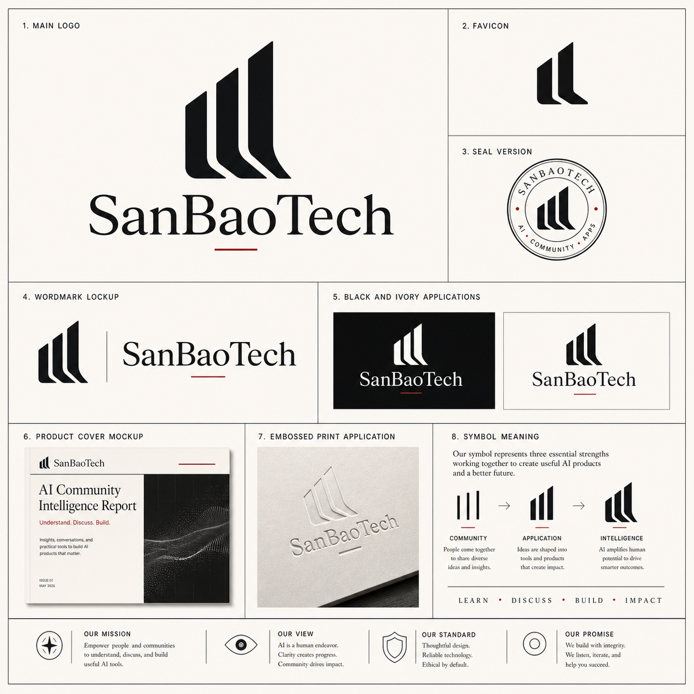
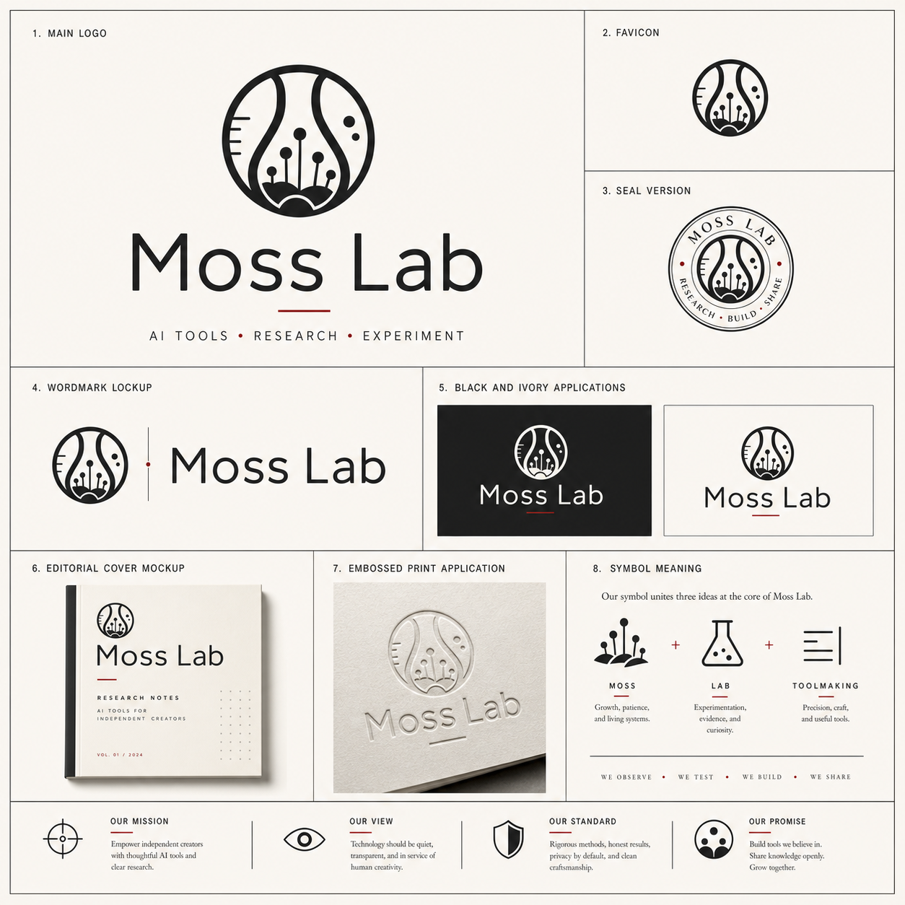
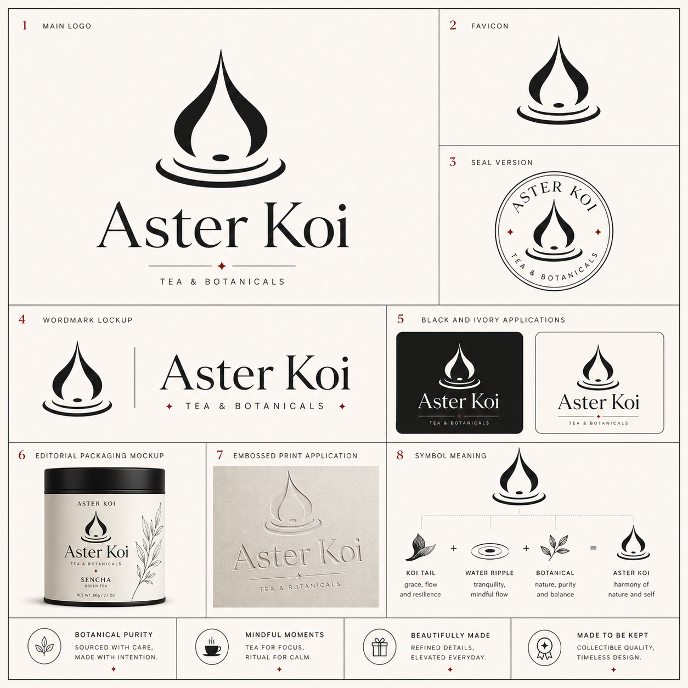
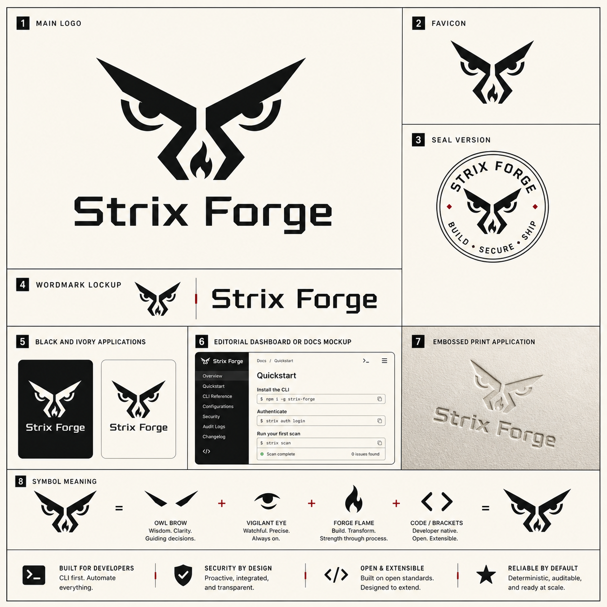
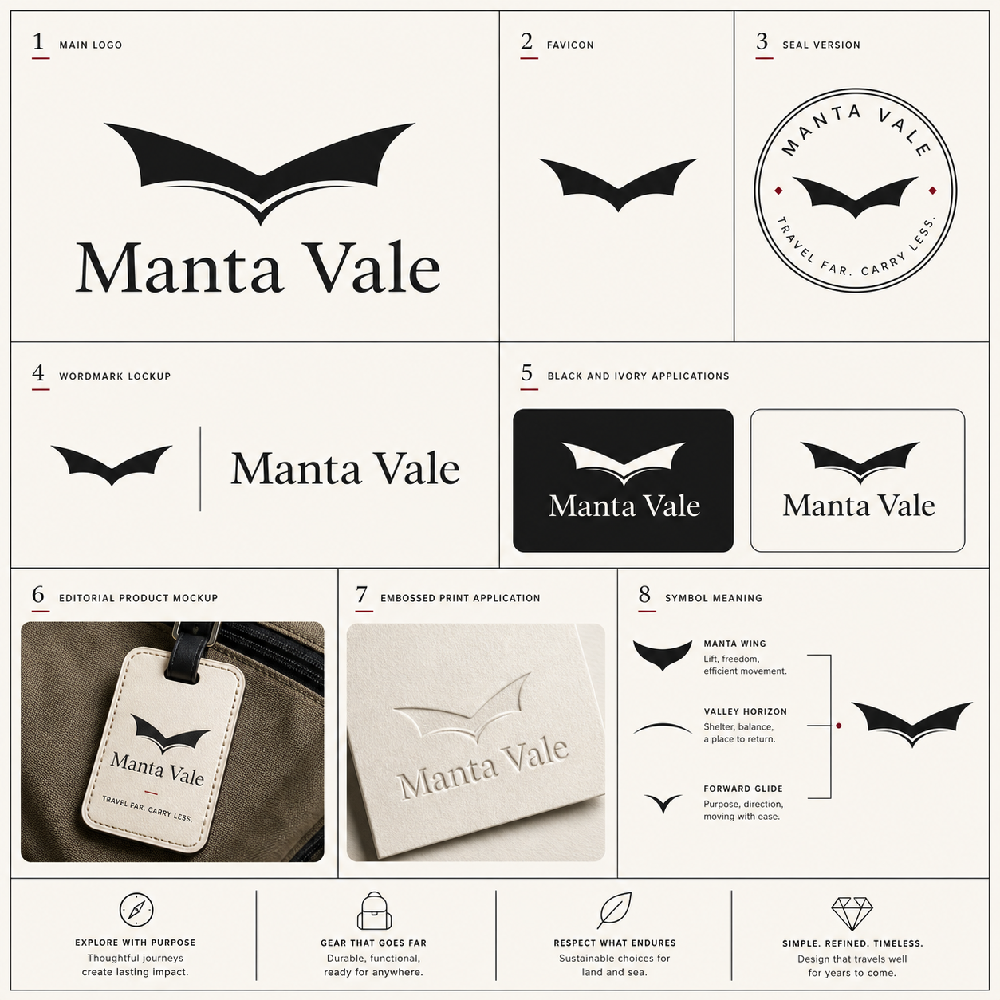
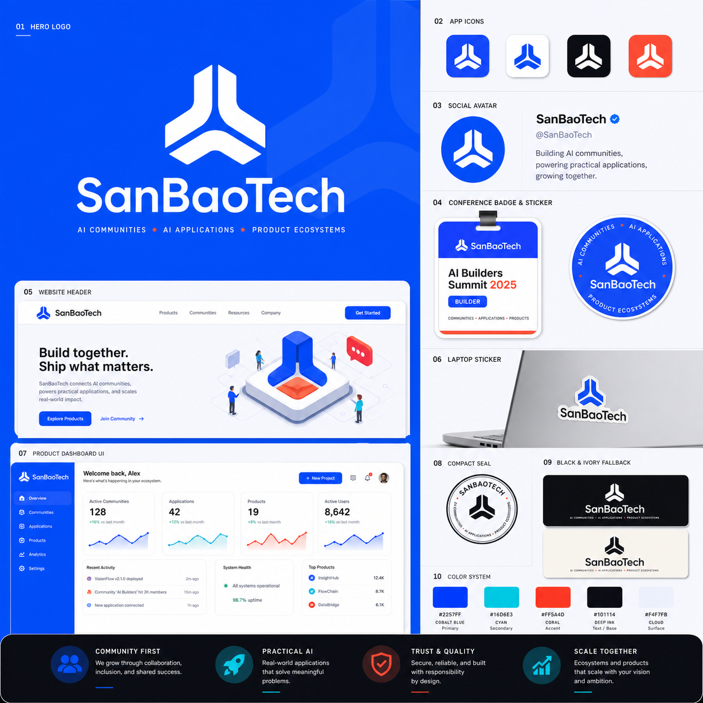
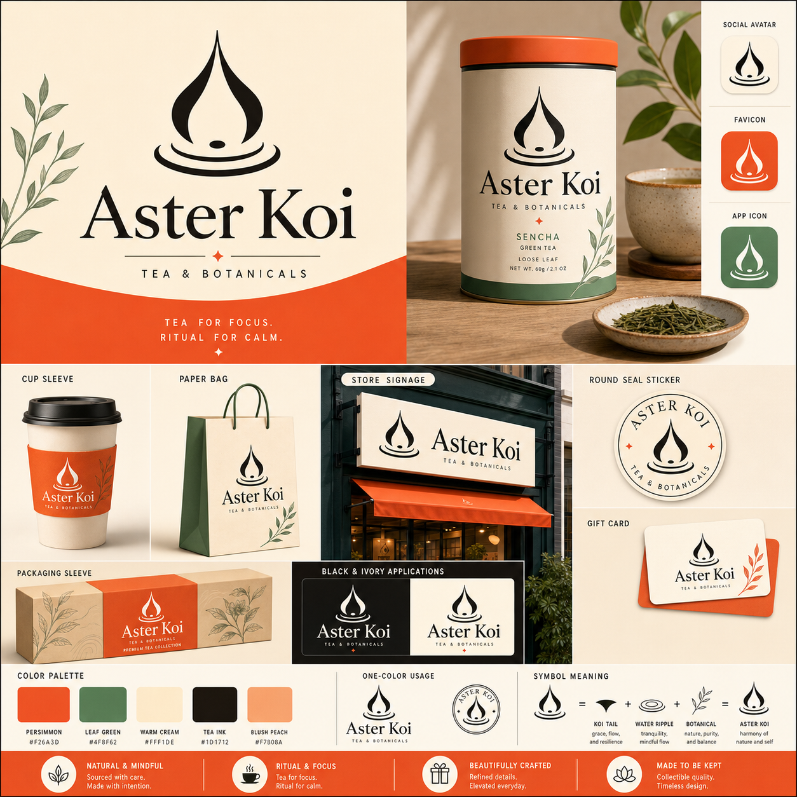
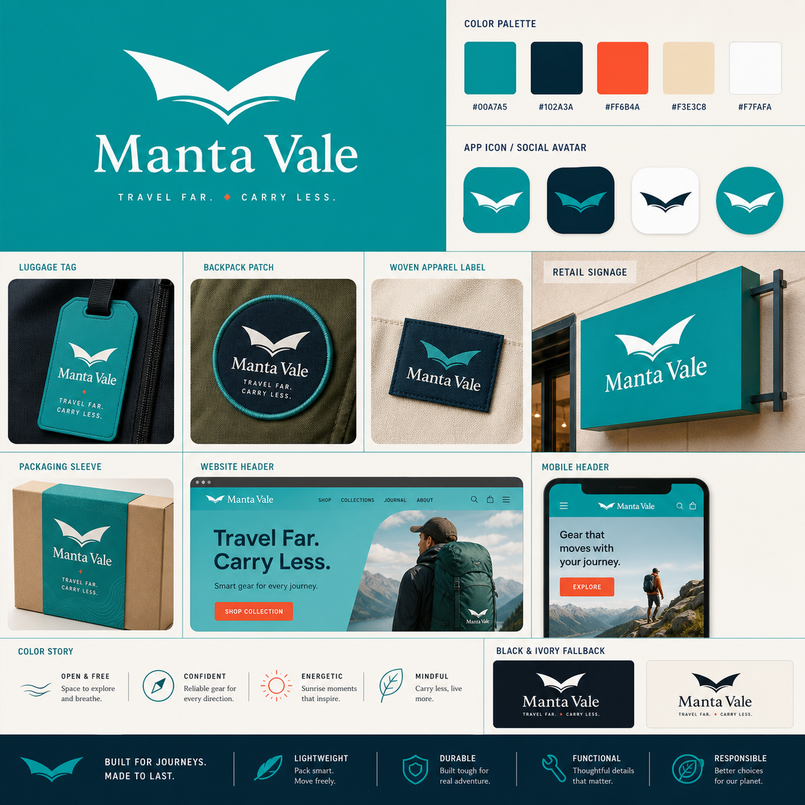

# Logo Generator Skill

*面向 AI Agent 的品牌设计系统*

**Agent Skills**，把品牌 brief 变成完整视觉识别系统 —— Logo 方向、品牌系统展示板、吉祥物标志、场景化配色。配合 **Codex** 通过 `imagegen` 直接生成展示板图片，或使用提示词在 GPT Image、Midjourney、Flux、Ideogram 中生成。

[](LICENSE) [](#安装) [](#技能) [](#codex-与图像生成)

**中文** &nbsp;·&nbsp; **[English](README.md)**

<p align="center"><sub>基础 Logo &mdash; 高级克制的企业与产品标志</sub></p>
<p align="center">
  
  
  
</p>

<p align="center"><sub>吉祥物 Logo &mdash; 从动物、角色和天体中提取标志性特征</sub></p>
<p align="center">
  
  
  
</p>

<p align="center"><sub>配色 &mdash; 场景化改色与标志性品牌色彩</sub></p>
<p align="center">
  
  
  
</p>

[安装](#安装) · [技能](#技能) · [怎么选？](#怎么选) · [Codex 与图像生成](#codex-与图像生成) · [工作流](#工作流) · [基础](#base-logo-generator) · [吉祥物](#mascot-logo-generator) · [配色](#logo-colorway-generator) · [Schema](#输入-schema) · [FAQ](#常见问题)

---

## 为什么需要它

很多 Logo 提示词停留在"做一个极简 Logo"。这个仓库是一套**完整的品牌设计系统** —— 三个模块化技能，既可以独立使用，也可以串联为流水线：

1. **`base-logo-generator`** —— 以高级克制为基础，生成企业和产品 Logo
2. **`mascot-logo-generator`** —— 从动物、角色或天体中提取标志性特征，生成吉祥物 Logo
3. **`logo-colorway-generator`** —— 为已有 Logo 增加场景化配色方案，让标志第一眼就抓住用户眼球

每个技能输出的是**品牌系统展示板** —— 带编号的方形规范网格，包含主标、favicon、seal、字标 lockup、黑白/象牙白应用、mockup、压印应用和 symbol meaning。不仅仅是白底居中单 Logo。

每个技能只做一件事。只装你需要的，或串联使用实现 brief → Logo → 配色的完整流水线。

## 安装

[`npx skills add`](https://github.com/vercel-labs/agent-skills) CLI 会扫描 `skills/` 目录，三个技能安装方式相同。

安装全部技能：

```bash
npx skills add https://github.com/SanbaoAI/logo-generator-skill
```

按**安装名**单独安装：

```bash
npx skills add https://github.com/SanbaoAI/logo-generator-skill --skill "base-logo-generator"
npx skills add https://github.com/SanbaoAI/logo-generator-skill --skill "mascot-logo-generator"
npx skills add https://github.com/SanbaoAI/logo-generator-skill --skill "logo-colorway-generator"
```

也可以复制 `SKILL.md` 到项目中，或粘贴到 Codex / Claude Code / Cursor 对话中：

```bash
cp -r skills/base-logo-generator ~/.codex/skills/
```

## 技能

每个技能只做一件事，不需要全部安装。`安装名` 列是你传给 `--skill` 的确切值。

| 技能（目录） | 安装名 | 说明 |
| --- | --- | --- |
| **base-logo-generator** | `base-logo-generator` | 高级克制的 Logo 设计，用于公司、产品、App、活动、文创标志。符号逻辑来自品牌策略、隐喻、几何、负形和字体，不从吉祥物出发。输出黑白/象牙白品牌系统展示板。 |
| **mascot-logo-generator** | `mascot-logo-generator` | 吉祥物衍生 Logo。从动物、角色、物体或天体出发，提取一个标志性特征（爪印、鹿角、月牙、象牙等），压缩为扁平、可缩放、可注册的剪影标志。展示板排版与基础技能一致。 |
| **logo-colorway-generator** | `logo-colorway-generator` | 后处理：为已有 Logo 或展示板增加场景化配色。保留原始符号、字标和轮廓。生成 2-4 条配色路线（含 hex 值）、标志性主色和真实应用场景。 |

### 怎么选？

- 先用 **base-logo-generator** 做企业和产品 Logo —— 干净、高级、克制。
- 当标志需要来自动物、角色或天体特征时，用 **mascot-logo-generator**。
- 当 Logo 已经存在、需要记忆点配色、场景应用或标志性主色时，用 **logo-colorway-generator**。
- 串联 **base → colorway** 或 **mascot → colorway** 实现完整品牌识别流水线。

## Codex 与图像生成

三个技能都原生支持 **Codex**。当图像生成工具可用时（如 Codex `imagegen`、ChatGPT Images），技能会先准备完整的创意方向，然后调用工具直接生成展示板。

**没有图像工具？** 技能会返回最终提示词，可直接粘贴到 GPT Image、Midjourney、Flux 或 Ideogram。

**图像优先提示：** 在 prompt 中声明流水线 —— 例如"生成 Logo 展示板，然后加配色" —— agent 会按顺序执行技能。

## 工作流

```
   第一步 — 生成 Logo（二选一）              第二步 — 后处理（可选）
 ┌─────────────────────────────────┐        ┌───────────────────────────────┐
 │  base-logo-generator             │        │                               │
 │    或                            │  ───▶  │  logo-colorway-generator      │
 │  mascot-logo-generator           │        │                               │
 └─────────────────────────────────┘        └───────────────────────────────┘
   Brief → Logo + 品牌系统展示板               已有 Logo → 配色 + 场景应用
```

每个技能都可独立使用。在任一 Logo 技能之后使用配色技能，即可增加标志性色彩系统。

---

## `base-logo-generator`

高级克制的 Logo 设计 —— 任何品牌识别的基础。符号来自品牌策略、隐喻、几何、负形或产品意义，不从吉祥物出发。结果应该看起来精致、经久耐用、具有独特辨识度。

**输出：**

| 板块 | 内容 |
| --- | --- |
| Logo Direction | 品牌定位、视觉气质、配色、字体方向、构图 |
| Symbol Concept | 核心隐喻、图形形态、负形逻辑、2-4 条备选路线 |
| Visual System Notes | 组合形式、单色适配、小尺寸表现、使用场景 |
| Brand System Board | 编号模块：主标、favicon、seal、lockup、应用、mockup、symbol meaning |
| Final Image Prompts | Universal、GPT Image、Midjourney、Flux、Ideogram 提示词 |
| Generated Logo | 图像工具可用时直接生成 |

<details>
<summary>示例输入</summary>

```json
{
  "brand_name": "SanBaoTech",
  "logo_type": "company",
  "brief": "一家专注 AI、AI 社区和 AI 应用的科技公司，帮助用户理解、交流并落地 AI 工具与产品。",
  "preferred_style": "minimal, premium, abstract",
  "output_layout": "brand-system-board",
  "target_platform": "all"
}
```
</details>

> 使用 base-logo-generator skill 生成 Logo 创意方案。

---

## `mascot-logo-generator`

吉祥物衍生标志，使用与基础技能一致的展示板排版。不同的符号逻辑：从动物、角色、物体或天体中提取一个最有识别度的特征，压缩为扁平、可缩放、可注册的剪影标志。

**适合的特征来源：** 爪印、头部侧影、鹿角、耳朵、象牙、眼形、面具、翅膀、尾巴曲线、月牙、头盔、水果切口。

不能复制知名吉祥物受保护的轮廓或商标比例。知名品牌仅作为方法参考。

<details>
<summary>示例输入</summary>

```json
{
  "brand_name": "Moonshade",
  "logo_type": "brand",
  "brief": "一个安静、神秘、带幻想气质的科技品牌，需要用于 App 图标、周边和社区身份的高级符号。",
  "preferred_style": "minimal, premium, mysterious",
  "mascot_source": "half moon",
  "mascot_feature_focus": "crescent edge and shadow cutout",
  "output_layout": "brand-system-board"
}
```
</details>

> 使用 mascot-logo-generator skill 生成一个吉祥物衍生 Logo。

---

## `logo-colorway-generator`

场景化配色后处理技能。在 Logo 概念、图片或完整展示板已存在后使用。保留原始符号、字标、轮廓和单色可用性 —— 只增加记忆点配色和真实应用规则。

创造一个**标志性品牌色彩**，第一眼就抓住注意力，并在 App 图标、包装、标识、社交媒体和周边中验证可用性。

**输出：**

| 板块 | 内容 |
| --- | --- |
| Existing Logo Read | 识别已有标志，说明必须保留的内容 |
| Palette Routes | 2-4 条带冲击等级和 hex 值的配色路线 |
| Chosen Color System | 标志性主色、主色、辅助色、强调色、中性色、深色、单色回退 |
| First-Glance Impact | 为什么在 App、货架、周边、社交中更容易被记住 |
| Scenario Layout | 背景、版式、应用模块如何让配色更有普适场景 |
| Color Application Rules | 每个颜色在 Logo 模块和 mockup 中如何应用 |
| Colorway Board Layout | 如何渲染场景化改色展示板 |
| Final Recolor Prompts | 多平台改色提示词 |

<details>
<summary>示例输入</summary>

```json
{
  "brand_name": "Aster Koi",
  "source_logo_description": "已有吉祥物衍生品牌系统展示板，符号为锦鲤尾纹和水波。",
  "brand_context": "精品茶饮和植物生活方式品牌。",
  "palette_direction": "暖象牙白底，柿子色作为标志性主色，池水绿辅助，墨黑保证识别",
  "color_impact": "memorable",
  "layout_mode": "adaptive-scenario-board",
  "colorway_count": 3,
  "output_layout": "colorway-board"
}
```
</details>

> 使用 logo-colorway-generator skill 给这个 Logo 增加配色。

---

## 输入 Schema

**基础 & 吉祥物**（共享核心字段）：

| 字段 | 必填 | 说明 |
| --- | --- | --- |
| `brand_name` | **是** | 公司、产品、活动、IP 或品牌名称 |
| `brief` | **是** | 被设计对象、受众、价值主张、品牌性格 |
| `logo_type` | 否 | `company` `brand` `product` `cultural-creative` `campaign` `advertising` `event` `app` `sub-brand` `personal-brand` `other` |
| `preferred_style` | 否 | minimal、modern、playful、corporate、tech、luxury、bold、organic 等 |
| `output_layout` | 否 | `brand-system-board`（默认）、`identity-board`、`standalone-logo`、`square-avatar`、`transparent-asset` |
| `target_platform` | 否 | `gpt-image` `midjourney` `flux` `ideogram` `all`（默认） |
| `render_image` | 否 | 图像工具可用时直接生成图片 |
| `reference_style` | 否 | 视觉参考的文字描述（仅参考方法，不复制标志） |
| `revision_notes` | 否 | 迭代反馈，用于优化上一版方案 |
| `output_language` | 否 | `zh-CN`（默认）或 `en` |

**吉祥物专属字段：**

| 字段 | 必填 | 说明 |
| --- | --- | --- |
| `mascot_source` | 否 | 吉祥物来源：鹿、熊爪、猛犸象头、月牙等 |
| `mascot_feature_focus` | 否 | 要提取的特征：鹿角、爪垫、象牙、耳朵、月牙边缘等 |

**配色** 核心字段：

| 字段 | 必填 | 说明 |
| --- | --- | --- |
| `brand_name` | **是** | 已有 Logo 中的准确品牌名 |
| `source_logo_description` | **是** | 描述已有 Logo/展示板及必须保留的内容 |
| `brand_context` | 否 | 品类、受众、品牌性格、使用场景 |
| `palette_direction` | 否 | 想要的色彩气质、指定颜色或需避开的颜色 |
| `color_impact` | 否 | `restrained` `memorable`（默认）`high-impact` `experimental` |
| `layout_mode` | 否 | `adaptive-scenario-board`（默认）、`preserve-original-board`、`campaign-colorway-board`、`application-mockup-board` |
| `audience_scope` | 否 | `broad-mainstream`（默认）、`premium-niche`、`youthful-pop`、`enterprise`、`cultural-collectible` |
| `background_direction` | 否 | 展示板背景或场景方向 |
| `colorway_count` | 否 | 配色路线数量，1-4（默认 3） |

完整 Schema：[`基础`](skills/base-logo-generator/input-schema.json) · [`吉祥物`](skills/mascot-logo-generator/input-schema.json) · [`配色`](skills/logo-colorway-generator/input-schema.json)

---

## 项目结构

```text
logo-generator-skill/
├── skill.sh                          # 技能路径解析
├── skills/
│   ├── llms.txt                      # 机器可读技能索引
│   ├── base-logo-generator/
│   │   ├── SKILL.md                  # 技能入口
│   │   ├── prompt.md                 # 详细风格与输出规则
│   │   ├── input-schema.json
│   │   └── assets/                   # 示例展示板和 keyframes
│   ├── mascot-logo-generator/
│   │   ├── SKILL.md · prompt.md · input-schema.json · assets/
│   └── logo-colorway-generator/
│       ├── SKILL.md · prompt.md · input-schema.json · assets/
├── README.md
├── README.zh-CN.md
└── LICENSE
```

## 常见问题

**只能生成提示词吗？**

不是。例如使用 Codex 时，技能可以直接生成合适的图像。

**为什么默认是品牌系统展示板，而不是白底居中 Logo？**

展示板可以同时检验主标、favicon、seal、lockup、单色应用、mockup 和 symbol meaning。白底单 Logo 无法告诉你它在 16×16 或单色印刷时是否还能用。

**吉祥物 Logo 只能选动物吗？**

不是。不论是动物、植物、天体还是食物等，skill 都是提取其标志性特征之后，生成更合适的 Logo。

## 许可证

[MIT](LICENSE) · Copyright (c) 2026 SanbaoAI
